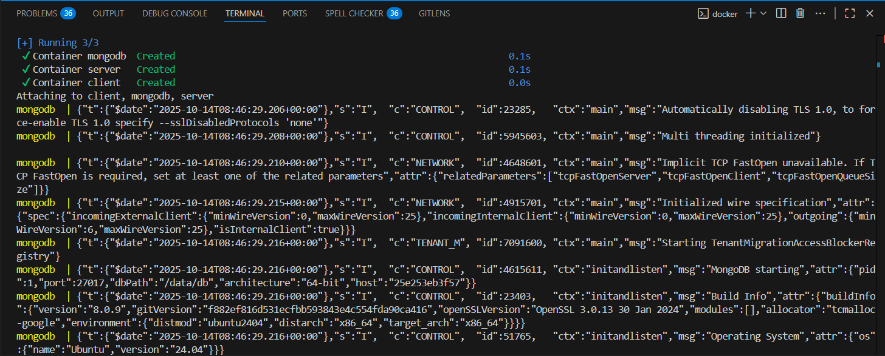

# MERN Stack Employee Records App

## Aperçu

Cette application est une solution MERN (MongoDB, Express, React, Node.js) permettant de gérer une liste d'employés. Elle utilise Docker et Docker Compose pour faciliter le déploiement et l'orchestration des services.

---

## Structure du projet

```
.
├── assets/
│   └── terminal.png
├── client/
│   ├── Dockerfile
│   ├── package.json
│   ├── .env
│   └── ...
├── server/
│   ├── Dockerfile
│   ├── package.json
│   ├── .env
│   └── ...
├── docker-compose.yml
└── README.md
```

---

## Capture d'écran du terminal

Voici un exemple d'exécution de la commande Docker Compose :



---

## Prérequis

- [Docker](https://www.docker.com/)
- [Docker Compose](https://docs.docker.com/compose/)

---

## Lancement du projet

1. Clone ce dépôt :
   ```bash
   git clone <url-du-repo>
   cd tp2-devops
   ```
2. Lance les services avec Docker Compose :
   ```bash
   docker-compose up --build
   ```
3. Accède à l'application :
   - Frontend : [http://localhost:3000](http://localhost:3000)
   - Backend API : [http://localhost:9000](http://localhost:9000)

---

## Variables d'environnement

- **client/.env**
  ```
  REACT_APP_API_URL=http://localhost:9000
  ```
- **server/.env**
  ```
  MONGO_URI=mongodb://mongodb:27017/todos
  PORT=9000
  ```

---

## Fonctionnalités

- Ajouter, modifier, supprimer et lister des employés.
- Architecture conteneurisée (client, serveur, base de données).
- Communication entre services via un réseau Docker dédié.

---

## Technologies

- **Frontend** : React, Bootstrap
- **Backend** : Node.js, Express
- **Database** : MongoDB
- **Conteneurisation** : Docker, Docker Compose

---
